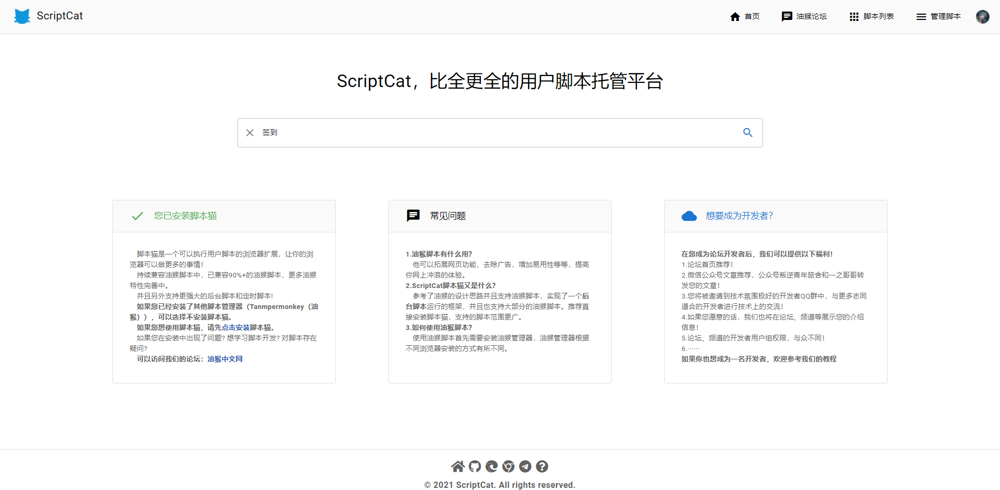
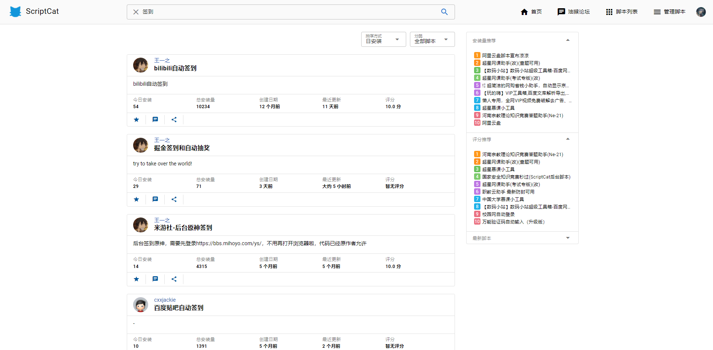

## 介绍

ScriptCat脚本库页面前端，用户可以在此页面搜索想要的脚本。

## 技术栈

- Quasar3
- Vue3
- TypeScript

## 预览

# 搜索页



# 脚本库页面


                                                       
## 项目运行

注意：本项目依赖node和quasar

``` shell
# git clone
git clone git@github.com:scriptscat/scriptlist-frontend.git

# Install the dependencies
npm i

# Start the app in development mode
quasar dev -m ssr

```

## 协议

- MIT